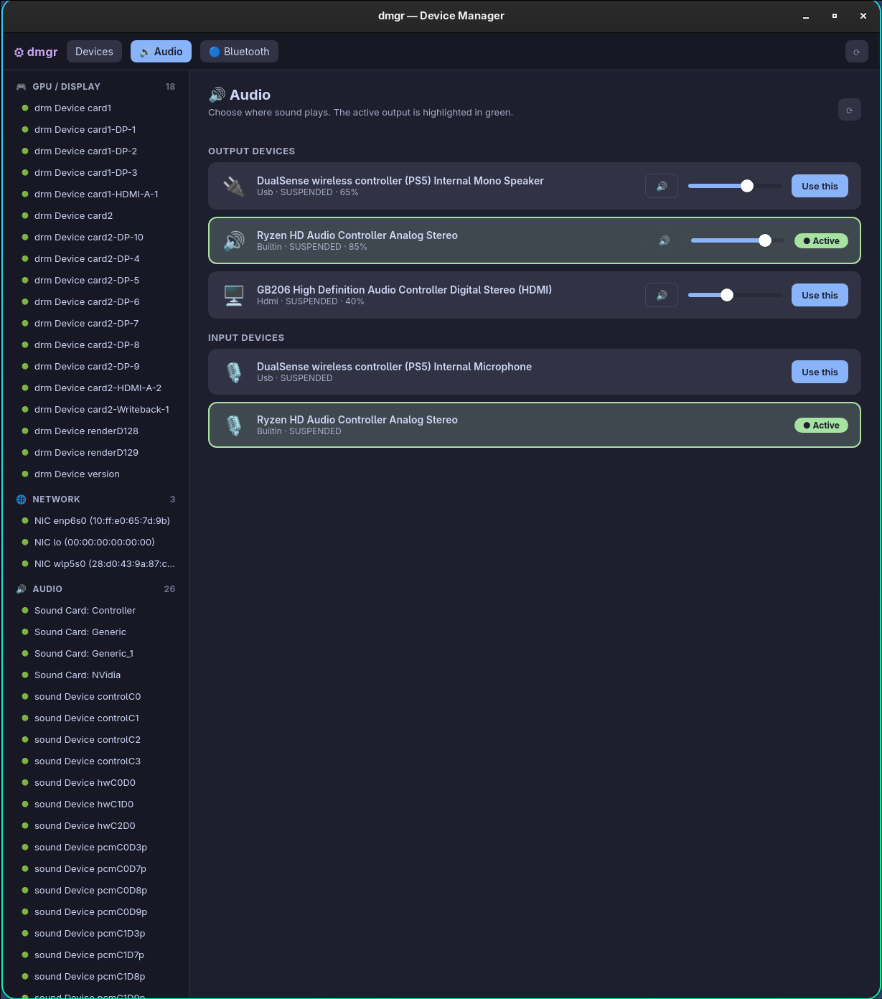

<div align="center">

# dmgr

**A modern, Windows-style Device Manager for Linux.**

Browse and manage your hardware — devices, drivers, audio outputs, Bluetooth and kernel modules — from a clean desktop UI.

[](https://github.com/Khinmmad/dmgr/actions/workflows/ci.yml)
[](https://github.com/Khinmmad/dmgr/releases/latest)
[](https://aur.archlinux.org/packages/dmgr-desktop)
[](LICENSE)



</div>

## Features

- 🔌 **Device browser** — every device grouped by bus (USB, PCIe, audio, input, storage, GPU, network…). Irrelevant kernel noise is hidden by default, with a *Show all* toggle and a parent/child **tree view**.
- ⚙️ **Driver actions, Windows-style** — enable/disable a device, install/change a driver (bind), uninstall a driver (unbind).
- 🔬 **Properties** — view every sysfs property; edit the ones the kernel allows. An *Advanced details* panel surfaces PCIe link speed/width, IRQs, USB speeds and power-management state.
- 🔊 **Audio** — a dedicated panel that lists all connected output devices, highlights the active one, and switches between them in one click, with volume & mute. Works with **PipeWire** (`pactl`/`wpctl`), **PulseAudio**, or **ALSA**.
- 🔵 **Bluetooth** — connect/disconnect/trust paired devices and toggle the adapter.
- 🧩 **Kernel modules** — list loaded modules, view `modinfo`, and load/unload via `modprobe`.
- ♻️ **Live hotplug** — the UI refreshes itself when you plug or unplug a device (udev).
- 🌍 **Adapts to your system** — detects your distro, session (X11/Wayland) and GPU, and shows distro-aware hints.

## Install

### Arch Linux (AUR)
```bash
paru -S dmgr-desktop      # or: yay -S dmgr-desktop
```

### Other distros
Grab a prebuilt bundle from the [latest release](https://github.com/Khinmmad/dmgr/releases/latest):

- `.deb` (Debian/Ubuntu) — includes the polkit helper, so privileged actions work out of the box
- `.rpm` (Fedora/openSUSE)
- `.AppImage` (portable, any distro)

> Privileged actions (enable/disable, bind/unbind, edit properties, load modules) are performed through **polkit** (`pkexec`).

## How it works

```
┌──────────────────────────┐        ┌─────────────────────────┐
│  React + TypeScript (UI)  │  IPC   │   Tauri (Rust) backend  │
│   src/  (Vite)            │◄──────►│   desktop/src-tauri/    │
└──────────────────────────┘        └────────────┬────────────┘
                                                  │ reuses
                                     ┌────────────┴────────────┐
                                     │  dmgr-core (Rust lib)   │
                                     │  sysfs · udev · control │
                                     └────────────┬────────────┘
                                                  │ pkexec
                                     ┌────────────┴────────────┐
                                     │  dmgr-polkit-helper     │
                                     │  (privileged ops)       │
                                     └─────────────────────────┘
```

The device logic lives in **`dmgr-core`** (Rust: sysfs scanning, udev monitoring, driver control). The desktop app is **Tauri v2 + React/TypeScript**, with an OS-abstracted backend (`DeviceBackend` trait) so other platforms can be plugged in. A small **egui** GUI (`dmgr-gui`) is kept as a lightweight native fallback.

## Build from source

Requires Rust, Node 20+, and the WebKitGTK/GTK dev libraries (e.g. on Arch: `webkit2gtk-4.1 gtk3`).

```bash
git clone https://github.com/Khinmmad/dmgr.git
cd dmgr

# Privileged helper (the deb/rpm bundles embed it)
cargo build --release -p dmgr-polkit-helper

# Desktop app (frontend + Tauri backend)
cd desktop
npm install
npm run tauri dev        # hot-reload dev window
# or a release binary:
npm run build && cargo build --release --manifest-path src-tauri/Cargo.toml
./src-tauri/target/release/dmgr-desktop
```

See [`desktop/README.md`](desktop/README.md) for packaging (deb/rpm/AppImage) and Nvidia/Wayland notes, and [`ROADMAP.md`](ROADMAP.md) for what's planned next.

## Project structure

```
dmgr/
├── crates/
│   ├── dmgr-core/           # Rust library: sysfs scanner, udev, driver/property control
│   ├── dmgr-gui/            # egui native GUI (lightweight fallback)
│   └── dmgr-polkit-helper/  # privileged helper invoked via pkexec
├── desktop/                 # Tauri v2 + React/TS app (primary UI)
│   ├── src/                 #   React frontend
│   └── src-tauri/           #   Rust backend (commands, audio, bluetooth, kernel…)
├── packaging/               # AUR PKGBUILDs
├── resources/               # .desktop entries + polkit policy
└── .github/workflows/       # CI (Linux + Windows) and release automation
```

## Contributing

Issues and PRs are welcome — especially edge cases in device detection on different hardware. The Linux backend is verified in CI (Linux + Windows builds, unit tests for the parsers).

## License

[MIT](LICENSE)
